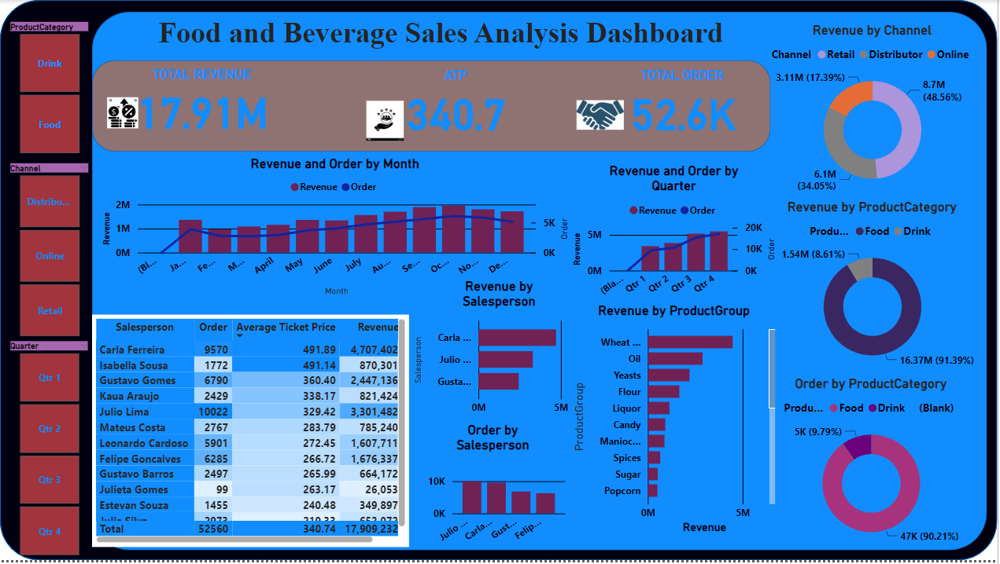

# Food-and-Beverage Sales Analysis

## Introduction:

The food and beverage sales analysis is represented in a dashboard typically referred to as a canvas. It comprises multiple charts, a graphs, cards and table that convey the story of how food and beverages were sold through various channels such as; Online, Retail, and Distributor.
___
## Problem Statement:
There are a few but important questions that need to be answered below;
1.	Which sales platform has the highest revenue?
2.	Which quarter of the year produce the highest revenue for the company?
3.	Which platform has the lowest revenue, and how can sales be improved on such a platform?
___
## Data Sourcing:
The dataset was sourced from a Youtube channel [Youtube](https://www.youtube.com/watch?v=yf2nf0ivFDg&t=2163s). It comprises of 2 datasets: Sales and Product.
The Sales table has one sheet and it consist of 10 columns and 260,097 rolls, while the Product table has one sheet with 799 rolls and 4 columns.
Get data [Here](https://drive.google.com/drive/folders/1Zs4inYgcXpGrGwbMiBARMTos4bVy8_1F)
___
## Skill/ Concept Demonstrated:
The following power BI features were used in the visualization:
-	Download data,
-	DAX, Quick measure,
-	Transformation,
-	Modelling,
-	Power query,
-	Button,
-	Filter.
___

## Modelling:

Automatic relationship was used and nothing was adjusted.
___

## Visualization:
The dashboard is navigated with help of __9__ side buttons on the left the side. These buttons aid in explaining the dashboard better, shedding more light on the revenue, sales channels and the quarter where the best and worst sale were recorded.
___

## Analysis:
-	**Drink and Food button**: These buttons filter the revenue, average total products, and the quantities ordered on every sale platform. From the analysis, the total revenue derived from the sale of Drink is __1.5M__ while for Food it is __16.37M__.
-	**Sales Channel button**: These sales channels comprise Online, Retail, and Distributor, and they show the amount of food and drink sold through these channels. From the given dataset, Retail has a Total Revenue of __8.70M__ and a Total Order of __22.3K__, making it the most utilized channel, while the Online channel has a lower Total Revenue of __3.11M__ and a Total Order of __12.0K__.
-	**The Quarter button**: This shows the progression of sale as it flows from the first quarter to the fourth quarter. From all indications, Retail sales channel has the highest turnover, increasing from __3.42M__ in the first quarter to __5.48M__ in the fourth quarter. It is interesting to note that Online revenue dropped on the fourth quarter to __1.06M__ compared to __1.09M__ in the third quarter. 

You can interact with the report [here]( https://app.powerbi.com/groups/me/reports/105a94a6-e0be-4e41-9373-6aeed09d43d5/ReportSection?experience=power-bi)
___

## RECOMMENDATIONS
From the dashboard, it is evident that the Retail sales channel generated the highest revenue. this highlights the need to:
-	Recruit competent social media marketers for the sales chaneel. In the 4th quarter, despite __4,415__ Orders being requested, only __1.06M__ revenue was generated, unlike previous quarter where __4,132__ orders resulted in __1.09M__ revenue. The social media space holds a lot of potentials and should be harnessed.
-	Professional who can sale DRINKS should be employed as well because the total revenue of drink compared to food is very low. To stay healthy and hydrated, we need more drink options. Improving sales in this platform can be achieved by focusing on drink sales. 🍹😃

